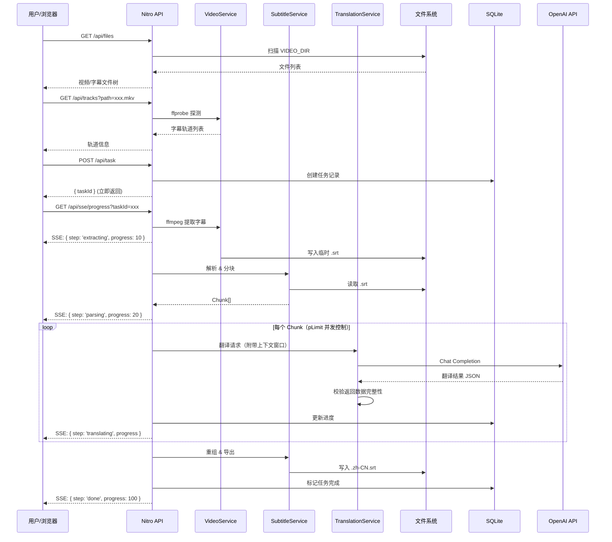

# SubX 项目方案设计

## 目录

- [一、项目介绍](#一项目介绍)
- [二、核心技术栈与依赖版本](#二核心技术栈与依赖版本)
- [三、系统架构设计](#三系统架构设计)
- [四、数据模型设计](#四数据模型设计)
- [五、核心业务流程详细设计](#五核心业务流程详细设计)
- [六、接口与通信设计](#六接口与通信设计)
- [七、错误处理与异常策略](#七错误处理与异常策略)
- [八、配置管理方案](#八配置管理方案)
- [九、安全设计](#九安全设计)
- [十、日志与可观测性](#十日志与可观测性)
- [十一、部署方案](#十一部署方案)
- [十二、性能与资源估算](#十二性能与资源估算)
- [十三、测试策略](#十三测试策略)
- [十四、版本规划与里程碑](#十四版本规划与里程碑)
- [十五、非功能性需求](#十五非功能性需求)

---

## 一、项目介绍

### 1.1 项目概述

SubX 是一款专为本地/私有云环境设计的 **自动化视频字幕提取与翻译工具**。它主要解决观看无官方中文字幕的生肉视频（如英美剧集、纪录片）时，手动寻找、提取和翻译字幕流程繁琐的问题。

### 1.2 核心特性

| 特性 | 说明 |
|------|------|
| **零上传** | 通过 Docker 目录挂载直接读取宿主机/NAS 上的大体积视频文件，避免 Web 上传带来的带宽和时间消耗 |
| **智能解析** | 自动探测视频封装内的所有字幕轨道，支持用户按需选择提取 |
| **外挂字幕翻译** | 直接翻译已有的 `.srt` / `.ass` 等外挂字幕文件，无需从视频中提取 |
| **上下文感知翻译** | 利用大语言模型进行分块（Chunking）翻译，附带上下文窗口，保留剧情连贯性 |
| **术语表支持** | 用户可自定义角色名、专有名词的固定翻译，确保全片一致性 |
| **双语字幕输出** | 支持输出纯译文字幕或"原文 + 译文"双语字幕 |
| **状态可视化** | 提供清晰的 Web UI，通过 SSE (Server-Sent Events) 实时推送长耗时任务的进度 |
| **历史记录** | 任务持久化存储，支持查看历史翻译记录和重新导出 |

### 1.3 支持的格式

| 类别 | 支持格式 |
|------|---------|
| 视频容器 | MKV、MP4、AVI、WEBM、TS |
| 内嵌字幕 | SRT、ASS/SSA、VTT |
| 外挂字幕 | `.srt`、`.ass`、`.ssa`、`.vtt` |
| 输出格式 | `.srt`（默认）、`.ass` |

---

## 二、核心技术栈与依赖版本

整个项目采用 **TypeScript** 进行全栈开发，保证类型安全和良好的开发体验。

### 2.1 前端 / 框架基座

| 技术 | 版本 | 用途 |
|------|------|------|
| Nuxt | v4.3.x | Vue 3 框架基座，提供路由、状态管理等开箱即用功能 |
| Nuxt UI | v3.x | 基于 Tailwind CSS 的现代化组件库，支持暗黑模式 |

### 2.2 服务端（Nuxt Nitro 引擎）

| 技术 | 版本 | 用途 |
|------|------|------|
| Node.js | v20 LTS+ | 底层运行环境 |
| fluent-ffmpeg | ^2.1.3 | FFmpeg 命令行的 Node.js 封装，用于视频/流处理 |
| better-sqlite3 | ^11.x | 轻量级嵌入式数据库，用于任务持久化和配置存储 |

### 2.3 AI 与核心工具类库

| 技术 | 版本 | 用途 |
|------|------|------|
| openai | ^4.28.0 | 官方 SDK，支持配置 Base URL 适配第三方/本地模型（Ollama、GLM-4 等） |
| srt-parser-2 | ^1.2.3 | SRT 字幕的 JSON 互转 |
| ass-compiler | ^0.1.x | ASS/SSA 字幕的解析与生成 |
| p-limit | ^5.0.0 | 严格控制大模型并发请求数，防止触发 Rate Limit |
| pino | ^8.x | 结构化日志输出 |

### 2.4 环境与部署

| 技术 | 用途 |
|------|------|
| FFmpeg | 安装在 Docker 容器内的 OS 级别依赖，用于视频处理 |
| Docker & Docker Compose | 多阶段构建，适配 AMD64 / ARM64 双架构 |

---

## 三、系统架构设计

### 3.1 整体架构

整个系统运行在一个单一的 Docker 容器中，前后端同构（基于 Nuxt），无需配置 Nginx 反向代理与跨域。

```
┌─────────────────────────────────────────────────────────────────┐
│                     Docker Container                            │
│                                                                 │
│  ┌───────────────────────────────────────────────────────────┐  │
│  │                   Nuxt 4 Application                      │  │
│  │                                                           │  │
│  │  ┌─────────────────────────────────────────────────────┐  │  │
│  │  │              视图层 (Vue 3 组件)                      │  │  │
│  │  │  文件浏览器 │ 轨道选择器 │ 参数配置 │ 任务进度       │  │  │
│  │  └────────────────────┬────────────────────────────────┘  │  │
│  │                       │ HTTP / SSE                        │  │
│  │  ┌────────────────────▼────────────────────────────────┐  │  │
│  │  │            API 路由层 (Nitro)                        │  │  │
│  │  │  RESTful 接口 │ SSE 进度推送 │ 配置管理接口          │  │  │
│  │  └────────────────────┬────────────────────────────────┘  │  │
│  │                       │                                   │  │
│  │  ┌────────────────────▼────────────────────────────────┐  │  │
│  │  │             核心服务层 (Server Utils)                 │  │  │
│  │  │                                                     │  │  │
│  │  │  VideoService      │ 调用 ffprobe/ffmpeg             │  │  │
│  │  │  SubtitleService   │ 解析/分块/重组字幕              │  │  │
│  │  │  TranslationService│ Prompt构建/队列调度/AI翻译      │  │  │
│  │  │  TaskService       │ 任务生命周期管理                │  │  │
│  │  │  ConfigService     │ 配置持久化与读取                │  │  │
│  │  └──────┬──────────────────────┬───────────────────────┘  │  │
│  │         │                      │                          │  │
│  │  ┌──────▼──────┐      ┌───────▼────────┐                 │  │
│  │  │  SQLite DB  │      │  文件系统 (FS)  │                 │  │
│  │  │  任务记录    │      │  /app/data      │                 │  │
│  │  │  配置存储    │      │  (宿主机挂载)    │                 │  │
│  │  │  翻译缓存    │      │                  │                 │  │
│  │  └─────────────┘      └────────────────┘                 │  │
│  └───────────────────────────────────────────────────────────┘  │
│                                                                 │
│  ┌─────────────┐                                                │
│  │   FFmpeg     │  (OS 级别依赖)                                 │
│  └─────────────┘                                                │
└─────────────────────────────────────────────────────────────────┘
```

### 3.2 核心流程时序图



### 3.3 服务职责划分

| 服务 | 职责 |
|------|------|
| **VideoService** | 调用本地 `ffprobe` 分析视频元数据；调用 `ffmpeg` 提取指定轨道的字幕并落盘 |
| **SubtitleService** | 读取字幕文件（SRT/ASS），解析为结构化数据，执行智能分块算法，翻译完成后重组导出 |
| **TranslationService** | 构建 Prompt（含上下文窗口和术语表），调度任务队列，携带上下文向 LLM 发起请求，校验结果 |
| **TaskService** | 管理任务全生命周期（创建/查询/更新/删除），与 SQLite 交互实现持久化 |
| **ConfigService** | 管理应用配置的持久化读写（API Key、模型设置等），支持环境变量覆盖 |

---

## 四、数据模型设计

### 4.1 核心数据结构

```typescript
/** 字幕条目 */
interface SubtitleEntry {
  id: string
  startTime: string      // "00:00:01,000"
  endTime: string        // "00:00:03,500"
  text: string           // 原文
  translatedText?: string // 译文
}

/** 翻译分块 */
interface TranslationChunk {
  chunkIndex: number
  entries: SubtitleEntry[]
  status: 'pending' | 'translating' | 'completed' | 'failed'
  retryCount: number
}

/** 翻译任务 */
interface TranslationTask {
  taskId: string
  filePath: string             // 源文件路径
  sourceType: 'embedded' | 'external'  // 内嵌字幕 or 外挂字幕
  trackIndex?: number          // 内嵌字幕轨道索引
  model: string                // 使用的模型
  targetLanguage: string       // 目标语言（如 zh-CN）
  outputMode: 'translated' | 'bilingual' // 纯译文 or 双语
  status: TaskStatus
  progress: number             // 0-100
  totalChunks: number
  completedChunks: number
  createdAt: string            // ISO 8601
  updatedAt: string
  error?: string
  outputPath?: string          // 输出文件路径
}

/** 任务状态枚举 */
type TaskStatus =
  | 'queued'
  | 'extracting'
  | 'parsing'
  | 'translating'
  | 'exporting'
  | 'done'
  | 'error'

/** 应用配置 */
interface AppConfig {
  apiKey: string               // 加密存储
  apiBaseUrl: string           // 支持自定义 Base URL
  defaultModel: string         // 默认模型
  targetLanguage: string       // 默认目标语言
  chunkSize: number            // 分块大小
  concurrency: number          // 并发数
  maxRetries: number           // 最大重试次数
  glossary: Record<string, string>  // 术语表
}
```

### 4.2 SQLite 表结构

```sql
-- 翻译任务表
CREATE TABLE tasks (
  task_id       TEXT PRIMARY KEY,
  file_path     TEXT NOT NULL,
  source_type   TEXT NOT NULL DEFAULT 'embedded',
  track_index   INTEGER,
  model         TEXT NOT NULL,
  target_lang   TEXT NOT NULL DEFAULT 'zh-CN',
  output_mode   TEXT NOT NULL DEFAULT 'translated',
  status        TEXT NOT NULL DEFAULT 'queued',
  progress      INTEGER NOT NULL DEFAULT 0,
  total_chunks  INTEGER DEFAULT 0,
  done_chunks   INTEGER DEFAULT 0,
  output_path   TEXT,
  error         TEXT,
  created_at    TEXT NOT NULL DEFAULT (datetime('now')),
  updated_at    TEXT NOT NULL DEFAULT (datetime('now'))
);

-- 应用配置表（KV 存储）
CREATE TABLE config (
  key           TEXT PRIMARY KEY,
  value         TEXT NOT NULL,
  updated_at    TEXT NOT NULL DEFAULT (datetime('now'))
);

-- 翻译缓存表（可选，用于避免重复翻译相同片段）
CREATE TABLE translation_cache (
  hash          TEXT PRIMARY KEY,  -- 原文内容的 SHA256
  source_text   TEXT NOT NULL,
  translated    TEXT NOT NULL,
  model         TEXT NOT NULL,
  target_lang   TEXT NOT NULL,
  created_at    TEXT NOT NULL DEFAULT (datetime('now'))
);
```

---

## 五、核心业务流程详细设计

这是最关键的后端数据流转逻辑，分为五个独立阶段。

### 阶段 1：轨道探测 (Track Probing)

**触发条件**：用户在前端选中一个视频文件（如 `xxx.mkv`）。

**执行逻辑**：

```bash
ffprobe -v error \
  -show_entries stream=index,codec_name,codec_type:stream_tags=language,title \
  -select_streams s \
  -of json \
  input.mkv
```

**返回数据示例**：

```json
[
  { "index": 2, "codec": "subrip", "language": "eng", "title": "English" },
  { "index": 3, "codec": "ass", "language": "fre", "title": "French" }
]
```

> **注意**：对于外挂字幕文件（`.srt` / `.ass`），跳过此阶段直接进入阶段 3。

### 阶段 2：字幕提取 (Extraction)

**触发条件**：用户确认提取的轨道（如 Index 2）并提交任务。

**执行逻辑**：

```bash
ffmpeg -i input.mkv -map 0:2 -c:s srt output_temp.srt
```

此过程相对较快（通常几秒内完成），提取完成后自动进入下一步。

### 阶段 3：解析与智能分块 (Parsing & Chunking)

**解析**：根据字幕格式选择对应的解析器：

- SRT → `srt-parser-2` 解析
- ASS/SSA → `ass-compiler` 解析

**统一输出格式**：

```json
[
  { "id": "1", "startTime": "00:00:01,000", "endTime": "00:00:03,500", "text": "Hello" },
  { "id": "2", "startTime": "00:00:04,000", "endTime": "00:00:06,200", "text": "How are you?" }
]
```

**智能分块策略**：采用基于 Token 的动态分块，而非固定行数切分，避免超出模型限制或在对话中间截断。

```typescript
function chunkByTokens(
  entries: SubtitleEntry[],
  maxTokens: number = 2000
): SubtitleEntry[][] {
  const chunks: SubtitleEntry[][] = []
  let currentChunk: SubtitleEntry[] = []
  let currentTokens = 0

  for (const entry of entries) {
    // 粗略估算：英文 1 词 ≈ 1 token，中文 1 字 ≈ 1 token
    const entryTokens = estimateTokens(JSON.stringify(entry))
    if (currentTokens + entryTokens > maxTokens && currentChunk.length > 0) {
      chunks.push(currentChunk)
      currentChunk = []
      currentTokens = 0
    }
    currentChunk.push(entry)
    currentTokens += entryTokens
  }

  if (currentChunk.length > 0) chunks.push(currentChunk)
  return chunks
}
```

### 阶段 4：并发翻译 (AI Translation) — 核心难点

#### 4.1 并发控制

初始化 `pLimit(concurrency)`（默认 3），保证最多同时 N 个 Chunk 在请求 API。

#### 4.2 上下文窗口滑动

每次翻译 Chunk 时，附带**前一个 Chunk 最后 5 条**的译文作为上下文参考，保持术语和语气的连贯性。

```
[上下文参考 - 前文最后5条译文] + [当前需翻译的 Chunk]
```

#### 4.3 Prompt 设计

```text
你是一个专业的影视字幕翻译。请结合上下文和术语表，将以下 JSON 数组中的 text 字段翻译为地道的{targetLanguage}。

要求：
1. 保持原有的 JSON 结构不变，绝对不能改变 id 字段。
2. 输出的条目数量必须与输入完全一致。
3. 仅输出合法的 JSON 数组，不要包含任何 markdown 标记或其他解释性文字。
4. 翻译风格自然流畅，符合影视字幕的表达习惯。

术语表（请严格遵守以下翻译）：
{glossary}

前文已翻译内容（仅供参考上下文，请勿输出）：
{previousContext}

待翻译内容：
{currentChunk}
```

#### 4.4 结果校验与容错

```typescript
function validateTranslation(input: SubtitleEntry[], output: any): boolean {
  // 1. 是否为合法 JSON 数组
  if (!Array.isArray(output)) return false
  // 2. 条目数量是否一致
  if (output.length !== input.length) return false
  // 3. ID 是否完全匹配
  return input.every((entry, i) => entry.id === output[i]?.id)
}
```

**重试策略**：

| 情况 | 处理方式 |
|------|---------|
| API 返回非法 JSON | 尝试正则修复 → 重试（最多 3 次） |
| 条目数量不匹配 | 直接重试 |
| 网络超时 | 指数退避重试（1s → 2s → 4s） |
| Rate Limit (429) | 读取 `Retry-After` 头后等待重试 |
| 连续 3 次失败 | 标记该 Chunk 为 `failed`，跳过并继续后续 Chunk |

### 阶段 5：重组与导出 (Reassembly & Export)

1. 所有 Chunk 翻译完成后，根据 ID 将翻译后的文本合并回原始的时间轴对象中
2. 如果用户选择 **双语模式**，则将原文和译文合并为 `原文\n译文` 的格式
3. 调用对应格式的序列化器生成输出文件：
   - SRT：`srt-parser-2` 的 `toSrt()` 方法
   - ASS：`ass-compiler` 的 `stringify()` 方法
4. **文件命名规则**：`[原视频名].[目标语言代码].srt`，如 `Movie.zh-CN.srt`
5. 输出文件保存在 **视频同级目录** 下
6. 更新 SQLite 任务记录为 `done`，记录 `outputPath`

---

## 六、接口与通信设计

基于 Nuxt 的文件路由规范，所有接口定义如下：

### 6.1 文件浏览

```
GET /api/files
```

- 读取 `VIDEO_DIR` 指定的目录，返回支持的视频和字幕文件树
- 响应：`{ files: FileNode[] }`

### 6.2 轨道探测

```
GET /api/tracks?path=<relative_path>
```

- 探测目标视频的字幕轨道
- 响应：`{ tracks: TrackInfo[] }`

### 6.3 提交翻译任务

```
POST /api/task
```

请求体：

```json
{
  "filePath": "movies/episode01.mkv",
  "sourceType": "embedded",
  "trackIndex": 2,
  "targetLanguage": "zh-CN",
  "outputMode": "translated"
}
```

响应（立即返回，不阻塞）：

```json
{
  "taskId": "uuid-xxxx"
}
```

> **注意**：API Key 和模型从服务端配置读取，不再随每次请求传递。

### 6.4 任务进度推送（SSE）

```
GET /api/sse/progress?taskId=<task_id>
```

- 前端通过 `EventSource` 连接
- 后端通过 `EventEmitter` 监听任务状态，实时推送事件

**事件格式**：

```
id: 1678901234567
event: progress
data: {"step":"translating","progress":45,"completedChunks":5,"totalChunks":12,"currentText":"正在翻译第5块..."}
```

**心跳保活**（每 15 秒）：

```
: keepalive
```

**断线重连**：支持 `Last-Event-ID` 请求头，从断点恢复推送。

### 6.5 任务状态查询（SSE 降级方案）

```
GET /api/task/:taskId
```

- 用于 SSE 连接断开后的主动轮询查询
- 响应：`{ task: TranslationTask }`

### 6.6 历史任务列表

```
GET /api/tasks?page=1&size=20
```

- 分页查询历史任务列表
- 响应：`{ tasks: TranslationTask[], total: number }`

### 6.7 配置管理

```
GET  /api/config          # 获取当前配置（API Key 脱敏返回）
PUT  /api/config          # 更新配置
```

### 6.8 术语表管理

```
GET  /api/glossary        # 获取术语表
PUT  /api/glossary        # 更新术语表
```

---

## 七、错误处理与异常策略

### 7.1 分层错误处理

| 环节 | 可能的异常 | 处理策略 | 用户提示 |
|------|-----------|---------|---------|
| 文件扫描 | 权限不足、路径不存在 | 捕获异常并返回错误码 | "无法访问视频目录，请检查 Docker 挂载配置" |
| FFprobe 探测 | 文件损坏、不支持的格式 | 返回明确错误码和说明 | "无法解析此文件，请确认文件格式是否受支持" |
| FFmpeg 提取 | 磁盘空间不足、进程崩溃 | 清理临时文件 + 错误上报 | "字幕提取失败：磁盘空间不足" |
| 字幕解析 | 文件编码异常、格式错误 | 尝试自动检测编码并转换 | "字幕文件格式异常，请确认文件完整性" |
| API 调用 | Rate Limit (429) | 读取 `Retry-After` + 指数退避重试 | "AI 服务请求频率受限，正在自动重试..." |
| API 调用 | 余额不足 (402) | 立即终止任务 | "API 余额不足，请充值后重试" |
| API 调用 | 网络超时 | 指数退避重试（最多 3 次） | "网络连接超时，正在重试..." |
| JSON 解析 | 模型返回非法格式 | 正则修复尝试 → 重试 → 标记跳过 | "AI 返回格式异常，正在重试..." |

### 7.2 错误码规范

```typescript
enum ErrorCode {
  // 文件相关 1xxx
  FILE_NOT_FOUND = 1001,
  FILE_ACCESS_DENIED = 1002,
  UNSUPPORTED_FORMAT = 1003,
  DISK_SPACE_INSUFFICIENT = 1004,

  // FFmpeg 相关 2xxx
  FFPROBE_FAILED = 2001,
  FFMPEG_EXTRACTION_FAILED = 2002,
  NO_SUBTITLE_TRACK = 2003,

  // 翻译相关 3xxx
  API_KEY_INVALID = 3001,
  API_RATE_LIMITED = 3002,
  API_QUOTA_EXCEEDED = 3003,
  TRANSLATION_TIMEOUT = 3004,
  INVALID_RESPONSE_FORMAT = 3005,

  // 系统相关 9xxx
  INTERNAL_ERROR = 9001,
  CONFIG_MISSING = 9002,
}
```

---

## 八、配置管理方案

### 8.1 配置优先级

所有配置项支持三层优先级（从高到低）：

```
环境变量 > SQLite 持久化配置 > 默认值
```

### 8.2 支持的配置项

| 环境变量 | 默认值 | 说明 |
|---------|--------|------|
| `VIDEO_DIR` | `/data` | 视频挂载目录 |
| `OPENAI_API_KEY` | - | OpenAI API 密钥 |
| `OPENAI_BASE_URL` | `https://api.openai.com/v1` | API 地址（支持自定义中转/本地模型） |
| `DEFAULT_MODEL` | `gpt-4o-mini` | 默认使用的模型 |
| `TARGET_LANGUAGE` | `zh-CN` | 默认目标翻译语言 |
| `CHUNK_SIZE` | `2000` | 分块大小（Token 数） |
| `CONCURRENCY` | `3` | 并发请求数 |
| `MAX_RETRIES` | `3` | 单个 Chunk 最大重试次数 |
| `AUTH_TOKEN` | - | Web UI 访问令牌（可选，为空则不启用鉴权） |
| `PORT` | `3000` | 服务监听端口 |
| `DB_PATH` | `/app/db/subx.db` | SQLite 数据库文件路径 |

---

## 九、安全设计

### 9.1 API Key 安全

| 措施 | 说明 |
|------|------|
| **服务端持久化** | API Key 通过设置页面配置一次，加密存储在 SQLite 中，不随每次请求传输 |
| **环境变量注入** | 支持通过 `OPENAI_API_KEY` 环境变量在 Docker 启动时预配置 |
| **脱敏返回** | GET 配置接口仅返回 `sk-****xxxx` 格式，不暴露完整 Key |
| **内存保护** | API Key 不出现在日志输出中 |

### 9.2 访问控制

- 支持通过 `AUTH_TOKEN` 环境变量设置访问令牌
- 当设置令牌后，所有 API 请求须携带 `Authorization: Bearer <token>` 头
- 适用于内网中存在多设备但不希望被其他人访问的场景

### 9.3 文件系统隔离

- 后端仅允许访问 `VIDEO_DIR` 指定的挂载目录
- 所有文件路径参数须经过路径遍历（Path Traversal）检查，禁止 `../` 等越权访问

---

## 十、日志与可观测性

### 10.1 日志规范

| 类别 | 日志级别 | 示例 |
|------|---------|------|
| 请求日志 | INFO | `[API] GET /api/files - 200 - 45ms` |
| 任务开始 | INFO | `[Task:abc123] 开始处理 episode01.mkv` |
| 翻译进度 | DEBUG | `[Task:abc123] Chunk 5/12 翻译完成` |
| 重试操作 | WARN | `[Task:abc123] Chunk 3 翻译失败，第2次重试` |
| 异常错误 | ERROR | `[Task:abc123] API 调用失败: 429 Rate Limited` |

### 10.2 技术选型

- 使用 `pino` 进行结构化 JSON 日志输出
- 日志输出到 `stdout/stderr`，便于 `docker logs` 查看
- 支持通过 `LOG_LEVEL` 环境变量控制日志级别（默认 `info`）

### 10.3 关键审计日志

记录以下关键操作，便于问题排查：

- 任务创建/完成/失败
- 配置变更（API Key 更换等）
- API Token 消耗统计（按任务汇总）

---

## 十一、部署方案

### 11.1 Docker 构建

在 Docker 构建时，直接适配 AMD64 和 ARM64 双架构，并采用多阶段构建减小镜像体积。

**Dockerfile 思路**：

```dockerfile
# ===== 阶段 1：构建 =====
FROM node:20-alpine AS builder
WORKDIR /app
COPY package.json yarn.lock ./
RUN yarn install --frozen-lockfile
COPY . .
RUN yarn build

# ===== 阶段 2：运行 =====
FROM node:20-alpine AS runner
WORKDIR /app

# 安装 FFmpeg
RUN apk add --no-cache ffmpeg

# 拷贝构建产物
COPY --from=builder /app/.output .output

# 创建数据库目录
RUN mkdir -p /app/db

ENV NODE_ENV=production
ENV VIDEO_DIR=/data
ENV DB_PATH=/app/db/subx.db
ENV PORT=3000

EXPOSE 3000

CMD ["node", ".output/server/index.mjs"]
```

### 11.2 Docker Compose

```yaml
services:
  subx:
    image: subx:latest
    container_name: subx
    restart: unless-stopped
    ports:
      - "3000:3000"
    volumes:
      # 挂载本地视频目录到容器内
      - /path/to/your/videos:/data
      # 持久化数据库（任务历史、配置）
      - subx-db:/app/db
    environment:
      - VIDEO_DIR=/data
      - OPENAI_API_KEY=sk-your-key-here       # 可选，也可通过 Web UI 配置
      - OPENAI_BASE_URL=https://api.openai.com/v1
      - DEFAULT_MODEL=gpt-4o-mini
      # - AUTH_TOKEN=your-secret-token          # 取消注释以启用访问控制

volumes:
  subx-db:
```

---

## 十二、性能与资源估算

### 12.1 典型场景估算

以 **45 分钟美剧单集** 为基准：

| 指标 | 估算值 | 说明 |
|------|--------|------|
| 字幕行数 | 400–800 行 | 取决于对话密度 |
| 分块数量 | 8–15 块 | 基于 Token 动态分块 |
| 单块翻译耗时 | 3–8 秒 | 取决于模型和网络延迟 |
| **单集总翻译时间** | **30–90 秒** | 并发数 = 3 |
| Token 消耗 | 3,000–8,000 tokens | 输入 + 输出 |
| 估算费用（gpt-4o-mini） | ≈ ¥0.01–0.03 / 集 | 按 OpenAI 官方定价 |

### 12.2 资源占用

| 资源 | 估算值 |
|------|--------|
| 容器内存 | < 200 MB（Node.js 进程） |
| 磁盘占用 | < 100 KB / 集（仅字幕文件） |
| SQLite 数据库 | < 10 MB（存储上千条任务记录） |
| Docker 镜像大小 | ≈ 200–300 MB（含 FFmpeg） |

---

## 十三、测试策略

### 13.1 测试分层

| 类型 | 工具 | 覆盖范围 | 优先级 |
|------|------|---------|--------|
| 单元测试 | Vitest | 分块算法、SRT/ASS 解析、JSON 校验、Token 估算 | P0 |
| 集成测试 | Vitest + undici | API 路由端到端、SQLite 操作、任务生命周期 | P1 |
| Mock 测试 | MSW | 模拟 OpenAI API 响应（正常/异常/Rate Limit） | P1 |
| E2E 测试 | Playwright | 完整用户流程：选文件 → 选轨道 → 翻译 → 下载 | P2 |

### 13.2 关键测试用例

- 分块算法：空数组、单条目、超长文本、多语言混合
- 翻译校验：正常响应、条目数不匹配、非法 JSON、ID 错乱
- 重试机制：网络超时、429 响应、连续失败
- 文件操作：路径遍历攻击、特殊字符文件名、权限不足
- SSE 通信：断线重连、并发订阅、心跳超时

---

## 十四、版本规划与里程碑

| 阶段 | 版本号 | 核心内容 | 预计周期 |
|------|--------|---------|---------|
| **MVP** | v0.1 | MKV 字幕提取 + SRT 翻译 + 基础 Web UI + 任务管理 | 2 周 |
| **体验优化** | v0.2 | SSE 进度推送 + 历史记录 + 错误处理完善 + 设置页面 | 1 周 |
| **功能扩展** | v0.3 | 多格式支持 + 外挂字幕翻译 + 术语表 + 双语字幕 | 2 周 |
| **正式发布** | v1.0 | 安全加固 + 性能优化 + 完善文档 + 自动化测试 | 1 周 |
| **进阶功能** | v1.x | 批量翻译 + 翻译缓存复用 + 多语言 UI + 通知集成 | 持续迭代 |

---

## 十五、非功能性需求

| 维度 | 要求 | 实现方式 |
|------|------|---------|
| **可用性** | 容器异常退出后自动重启 | `restart: unless-stopped` |
| **可用性** | 任务中断后可恢复 | SQLite 持久化 + Chunk 级别状态跟踪 |
| **可维护性** | 代码模块化、职责清晰 | 服务层分层（见架构设计） |
| **可维护性** | 日志完善、问题可追溯 | pino 结构化日志 |
| **可扩展性** | 未来可支持更多翻译引擎 | TranslationService 抽象为策略模式 |
| **可扩展性** | 未来可支持更多字幕格式 | SubtitleService 抽象解析器接口 |
| **安全性** | API Key 不泄露 | 加密存储 + 脱敏返回 |
| **安全性** | 防止未授权访问 | 可选 AUTH_TOKEN 鉴权 |
| **安全性** | 防止路径遍历攻击 | 文件路径白名单校验 |
| **兼容性** | 支持主流架构 | AMD64 / ARM64 双架构 Docker 镜像 |
| **兼容性** | 支持主流 NAS | Synology / QNAP 等 Docker 环境 |